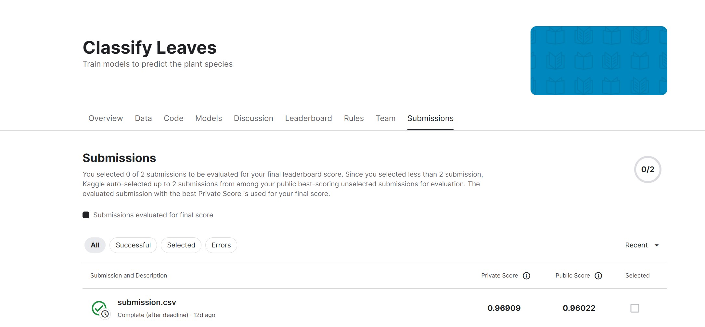

# Classify Leaves
<!-- vscode-markdown-toc -->
* 1. [What is Data](#WhatisData)
* 2. [How to Train](#HowtoTrain)
* 3. [How to Test](#HowtoTest)
* 4. [Result](#Result)

<!-- vscode-markdown-toc-config
	numbering=true
	autoSave=true
	/vscode-markdown-toc-config -->
<!-- /vscode-markdown-toc -->

##  1. <a name='WhatisData'></a>What is Data

这是经典的分类任务所需的`dataloader`样式。
```python
class LeavesData(Dataset):
    def __init__(self, csv_name, file_path, mode='train', valid_ratio=0.2):

        self.file_path = file_path
        self.mode = mode

        self.data = pd.read_csv(file_path + csv_name)  #header=None是去掉表头部分
        # 计算 length
        self.data_len = len(self.data['image'])
        self.train_len = int(self.data_len * (1 - valid_ratio))

        if self.mode == 'train':
            transform = transforms.Compose([
                transforms.Resize((224, 224)),
                transforms.RandomHorizontalFlip(),
                transforms.RandomVerticalFlip(),
                transforms.ToTensor(),
                transforms.Normalize(mean=[0.485, 0.456, 0.406], std=[0.229, 0.224, 0.225]),
            ])
        else:
            # valid和test不做数据增强
            transform = transforms.Compose([
                transforms.Resize((224, 224)),
                transforms.ToTensor(),
                transforms.Normalize(mean=[0.485, 0.456, 0.406], std=[0.229, 0.224, 0.225]),
            ])
        
        # if self.mode == 'train':
        #     transform = albumentations.Compose([
        #         albumentations.Resize(320, 320),
        #         albumentations.HorizontalFlip(p=0.5),
        #         albumentations.VerticalFlip(p=0.5),
        #         albumentations.Rotate(limit=180, p=0.7),
        #         albumentations.RandomBrightnessContrast(),
        #         albumentations.ShiftScaleRotate(
        #             shift_limit=0.25, scale_limit=0.1, rotate_limit=0
        #         ),
        #         albumentations.Normalize(
        #             [0.485, 0.456, 0.406], [0.229, 0.224, 0.225],
        #             max_pixel_value=255.0, always_apply=True
        #         ),
        #         ToTensorV2(p=1.0),
        #     ])
        # else:
        #     transform = albumentations.Compose([
        #         albumentations.Resize(320, 320),
        #         albumentations.Normalize(
        #             [0.485, 0.456, 0.406], [0.229, 0.224, 0.225],
        #             max_pixel_value=255.0, always_apply=True
        #         ),
        #         ToTensorV2(p=1.0),

        #     ])
        
        self.transform = transform
        
        if mode == 'train':
            # 第一列包含图像文件的名称
            self.images = np.asarray(self.data.iloc[0:self.train_len, 0])  #self.data_info.iloc[1:,0]表示读取第一列，从第二行开始到train_len
            # 第二列是图像的 label
            self.labels = np.asarray(self.data.iloc[0:self.train_len, 1])
        elif mode == 'valid':
            self.images = np.asarray(self.data.iloc[self.train_len:, 0])  
            self.labels = np.asarray(self.data.iloc[self.train_len:, 1])
        elif mode == 'test':
            self.images = np.asarray(self.data.iloc[0:, 0])
        
        self.length = len(self.images)

        print('Finished reading the {} set of Leaves Dataset ({} samples found)'
              .format(mode, self.length))

    def __getitem__(self, index):
        # 从 image_arr中得到索引对应的文件名
        image_path = self.images[index]

        # 读取图像文件
        image = Image.open(self.file_path + image_path)
        image = self.transform(image)

        # image = cv2.imread(self.file_path + image_path)
        # image = self.transform(image = image)['image']

        
        if self.mode == 'test':
            return image
        else:
            # 得到图像的 string label
            label = self.labels[index]
            # number label
            number_label = class_to_num[label]

            return image, number_label  #返回每一个index对应的图片数据和对应的label

    def __len__(self):
        return self.length
```

##  2. <a name='HowtoTrain'></a>How to Train

利用了两个预训练的模型`resnet50`和`resnext50_32x4d`分别训练数据数据，并将过程中的最佳模型保存代码如下

```python
    def train(self):
        best_acc = 0

        for epoch in range(self.epoch_num):
            self.model.train()

            train_loss_list = []
            train_acc_list = []

            for batch in tqdm(self.train_loader):
                imgs, labels = batch
                imgs = imgs.to(self.device)
                labels = labels.to(self.device)

                logits = self.model(imgs)

                loss = self.criterion(logits, labels)

                self.optimizer.zero_grad()
                loss.backward()
                self.optimizer.step()
                acc = (logits.argmax(dim=-1) == labels).float().mean()

                train_acc_list.append(acc)
                train_loss_list.append(loss.item())
            self.scheduler.step()
            train_loss = sum(train_loss_list) / len(train_loss_list)
            train_acc = sum(train_acc_list) / len(train_acc_list)

            print(f"[ Train | {epoch + 1:03d}/{self.epoch_num:03d} ] loss = {train_loss:.5f}, acc = {train_acc:.5f}")

            self.model.eval()

            valid_loss_list = []
            valid_acc_list = []

            for batch in tqdm(self.valid_loader):
                imgs, labels = batch
                imgs = imgs.to(self.device)
                labels = labels.to(self.device)

                with torch.no_grad():
                    logits = self.model(imgs)
                
                loss = self.criterion(logits, labels)

                acc = (logits.argmax(dim=-1) == labels).float().mean()

                valid_acc_list.append(acc)
                valid_loss_list.append(loss)

            valid_loss = sum(valid_loss_list) / len(valid_loss_list)
            valid_acc = sum(valid_acc_list) / len(valid_acc_list)

            print(f"[ Valid | {epoch + 1:03d}/{self.epoch_num:03d} ] loss = {valid_loss:.5f}, acc = {valid_acc:.5f}")

            if valid_acc > best_acc:
                best_acc = valid_acc
                torch.save(self.model.state_dict(), str(epoch) + '_' + self.model_path)
```

其中分别训练的意思是需要更改`ModelTrain`这一类中的`self.model`的值为训练的模型，然后训练即可，另外，保存的模型命名为`str(epoch) + '_' + self.model_path`也可以自行更改。


##  3. <a name='HowtoTest'></a>How to Test

在训练的过程中得到许多模型，可以从中选择一些表现不错的模型的路径写入`model_path`，将各个模型预测到的类别，写成一个list，然后随机从中选择最终答案，显然越多模型认为处于这一类，其被认定为这一类的概率最大，然后运行即可测试并得到对应的`submission.csv`，代码如下

```python
def test(self):
        model_path = ['resnet50_20.ckpt',
                      'resnet50_25.ckpt',
                      'resnet50_30.ckpt',
                      'resnext50_32x4d_20.ckpt',
                      'resnext50_32x4d_25.ckpt'
                      ]
        predictions_list = []
        for i in range(self.model_num):
            # model = models.resnet50(weights=models.ResNet50_Weights.IMAGENET1K_V1)
            # model.fc = nn.Linear(self.model.fc.in_features, classes_num)
            
            model = self.model.to(self.device)
            model.load_state_dict(torch.load(model_path[i], map_location=torch.device('cuda:0')))

            model.eval()

            predictions = []
            for batch in tqdm(self.test_loader):
                imgs = batch

                imgs = imgs.to(self.device)


                with torch.no_grad():
                    logits = model(imgs)
                logits = torch.argmax(logits,dim=1).reshape(-1)
                predictions.extend(logits.cpu().numpy().tolist())
            predictions_list.append(predictions)
        
        for i in range(len(predictions_list[0])):
            possible_list = []
            for j in range(self.model_num):
                possible_list.append(predictions_list[j][i])
            predictions.append(random.sample(possible_list, 1)[0])

        preds = []
        for i in predictions:
            preds.append(num_to_class[i])
        test_data = pd.read_csv(self.test_name)
        test_data['label'] = pd.Series(preds)
        submission = pd.concat([test_data['image'], test_data['label']], axis=1)
        submission.to_csv(self.savefile_path, index=False)
```

##  4. <a name='Result'></a>Result

